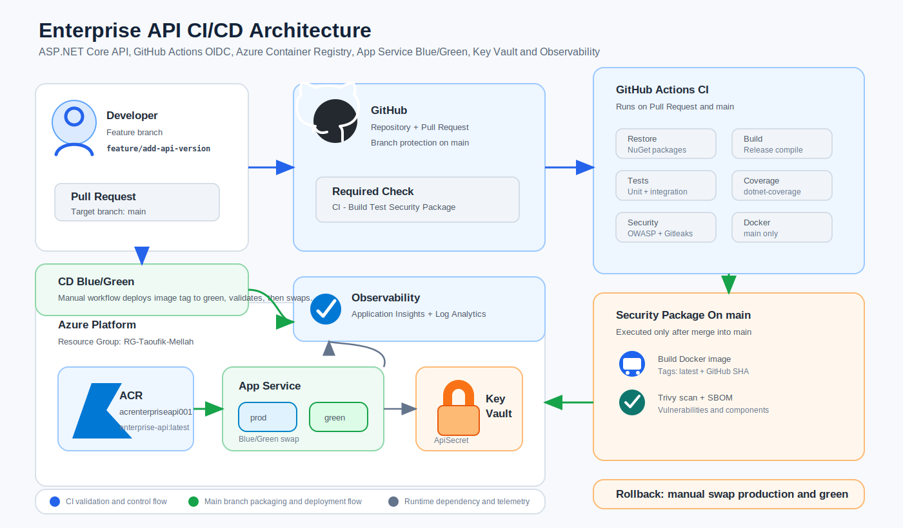

# Enterprise API CI/CD

Projet de reference pour construire une API ASP.NET Core 8 avec tests, Docker, Azure App Service, Azure Container Registry, Key Vault, Application Insights et GitHub Actions avec OIDC.

L'objectif est de montrer une chaine CI/CD professionnelle :

- developpement d'une API .NET ;
- tests unitaires et tests d'integration ;
- packaging Docker ;
- scan qualite et securite ;
- push d'image vers Azure Container Registry ;
- deploiement Blue/Green sur Azure App Service ;
- rollback manuel par swap ;
- protection de branche et Pull Request obligatoire.

## Architecture



Le schema montre le flux principal :

- le developpeur pousse une branche `feature/*` ;
- une Pull Request vers `main` declenche le CI ;
- apres merge dans `main`, le CI construit, scanne et pousse l'image Docker dans ACR ;
- le workflow CD manuel deploie l'image sur le slot `green` ;
- le slot `green` est teste avant le swap vers production ;
- le rollback manuel refait un swap inverse entre `production` et `green`.

Ressources Azure utilisees :

```text
Resource Group: RG-Taoufik-Mellah
Location: francecentral
ACR: acrenterpriseapi001
App Service Plan: asp-enterprise-api-prod
Web App: app-enterprise-api-prod
Slot: green
Key Vault: kv-entapi-tm-prod
Secret: ApiSecret
Log Analytics: law-enterprise-api-prod
Application Insights: appi-enterprise-api-prod
```

## Structure

```text
enterprise-api-cicd/
|-- src/
|   `-- Enterprise.Api/
|       |-- Program.cs
|       |-- Enterprise.Api.csproj
|       |-- appsettings.json
|       |-- appsettings.Development.json
|       `-- Properties/
|           `-- launchSettings.json
|-- tests/
|   |-- Enterprise.Api.UnitTests/
|   |   |-- UnitTest1.cs
|   |   |-- GlobalUsings.cs
|   |   `-- Enterprise.Api.UnitTests.csproj
|   `-- Enterprise.Api.IntegrationTests/
|       |-- UnitTest1.cs
|       |-- WeatherForecastTests.cs
|       |-- GlobalUsings.cs
|       `-- Enterprise.Api.IntegrationTests.csproj
|-- .github/
|   `-- workflows/
|       |-- ci.yml
|       |-- cd-prod.yml
|       `-- rollback-prod.yml
|-- scripts/
|   `-- create-azure-resources.ps1
|-- Dockerfile
|-- .dockerignore
|-- .gitignore
|-- EnterpriseApi.sln
|-- EnterpriseApi.slnx
`-- README.md
```

## Prerequis

Installer :

- Git ;
- .NET SDK 8 ;
- Docker Desktop ;
- Azure CLI ;
- un compte Azure avec les droits RBAC necessaires ;
- un depot GitHub.

Verifier .NET :

```powershell
dotnet --list-sdks
```

Cette commande liste les SDK .NET installes. Il faut voir une version `8.x`.

Verifier Azure CLI :

```powershell
az version
```

Cette commande verifie que Azure CLI est disponible.

## Creation Du Projet .NET

Commandes utilisees depuis le dossier parent :

```powershell
mkdir enterprise-api-cicd
cd enterprise-api-cicd
dotnet new sln -n EnterpriseApi
mkdir src tests
dotnet new webapi -n Enterprise.Api -o src/Enterprise.Api
dotnet new xunit -n Enterprise.Api.UnitTests -o tests/Enterprise.Api.UnitTests
dotnet new xunit -n Enterprise.Api.IntegrationTests -o tests/Enterprise.Api.IntegrationTests
dotnet sln add src/Enterprise.Api/Enterprise.Api.csproj
dotnet sln add tests/Enterprise.Api.UnitTests/Enterprise.Api.UnitTests.csproj
dotnet sln add tests/Enterprise.Api.IntegrationTests/Enterprise.Api.IntegrationTests.csproj
dotnet add tests/Enterprise.Api.UnitTests reference src/Enterprise.Api
dotnet add tests/Enterprise.Api.IntegrationTests reference src/Enterprise.Api
dotnet add tests/Enterprise.Api.IntegrationTests package Microsoft.AspNetCore.Mvc.Testing
```

Explication :

- `mkdir enterprise-api-cicd` cree le dossier du projet ;
- `cd enterprise-api-cicd` se place dans ce dossier ;
- `dotnet new sln` cree la solution ;
- `mkdir src tests` separe le code applicatif et les tests ;
- `dotnet new webapi` cree l'API ASP.NET Core ;
- `dotnet new xunit` cree les projets de tests ;
- `dotnet sln add` ajoute les projets a la solution ;
- `dotnet add reference` permet aux tests de referencer l'API ;
- `Microsoft.AspNetCore.Mvc.Testing` permet de tester l'API en memoire avec `WebApplicationFactory`.

## API

Fichier principal :

```text
src/Enterprise.Api/Program.cs
```

Endpoints disponibles :

```text
GET /health
GET /ready
GET /version
GET /api/products
GET /api/products/{id}
```

Role des endpoints :

- `/health` verifie que l'application repond ;
- `/ready` indique que l'application est prete ;
- `/version` retourne le nom de l'application, la version, l'environnement et l'heure UTC ;
- `/api/products` retourne une liste de produits ;
- `/api/products/{id}` retourne un produit par identifiant.

## Build Et Tests Locaux

Depuis la racine du projet :

```powershell
cd C:\Users\taoufik.mellah\cicd\enterprise-api-cicd
dotnet restore
dotnet build EnterpriseApi.sln
dotnet test EnterpriseApi.sln
```

Explication :

- `cd` se place dans la racine du projet ;
- `dotnet restore` restaure les packages NuGet ;
- `dotnet build` compile la solution ;
- `dotnet test` lance tous les tests.

Tests unitaires uniquement :

```powershell
dotnet test tests/Enterprise.Api.UnitTests/Enterprise.Api.UnitTests.csproj
```

Tests d'integration uniquement :

```powershell
dotnet test tests/Enterprise.Api.IntegrationTests/Enterprise.Api.IntegrationTests.csproj
```

## Docker

Le `Dockerfile` utilise un build multi-stage :

```text
Stage build
  -> image mcr.microsoft.com/dotnet/sdk:8.0
  -> restore
  -> publish

Stage runtime
  -> image mcr.microsoft.com/dotnet/aspnet:8.0
  -> copie du publish
  -> exposition du port 8080
  -> lancement Enterprise.Api.dll
```

Construire l'image localement :

```powershell
docker build -t enterprise-api:local .
```

Explication :

- `docker build` construit une image Docker ;
- `-t enterprise-api:local` donne le nom et le tag de l'image ;
- `.` utilise le dossier courant comme contexte Docker.

Lancer l'API localement dans Docker :

```powershell
docker run -p 8080:8080 enterprise-api:local
```

Explication :

- `docker run` lance un conteneur ;
- `-p 8080:8080` mappe le port local 8080 vers le port 8080 du conteneur ;
- `enterprise-api:local` est l'image a lancer.

Tester :

```powershell
curl http://localhost:8080/health
curl http://localhost:8080/ready
curl http://localhost:8080/version
curl http://localhost:8080/api/products
```

## Fichiers Ignore

`.dockerignore` evite d'envoyer a Docker les fichiers inutiles :

```text
bin/
obj/
.git/
.github/
.vscode/
README.md
```

`.gitignore` evite de versionner les fichiers locaux ou generes :

```text
bin/
obj/
.vs/
.vscode/
*.user
*.suo
TestResults/
coverage/
.env
```

## Azure

Le script pret a lancer est :

```text
scripts/create-azure-resources.ps1
```

Avant de l'utiliser, modifier :

```powershell
$GITHUB_ORG = "ton-user-ou-organisation"
```

Puis executer :

```powershell
.\scripts\create-azure-resources.ps1
```

Le script cree ou configure :

- Azure Container Registry ;
- App Service Plan Linux `P1v3` ;
- Web App Linux container ;
- slot `green` ;
- Always On ;
- Key Vault ;
- secret `ApiSecret` ;
- Log Analytics Workspace ;
- Application Insights ;
- Managed Identity App Service ;
- droits `Key Vault Secrets User` pour l'App Service ;
- droits `AcrPull` pour l'App Service ;
- App Registration GitHub Actions ;
- Service Principal ;
- droits `Contributor` sur le Resource Group ;
- droits `AcrPush` sur l'ACR ;
- federation OIDC GitHub Actions.

## GitHub Variables

Creer ces variables dans GitHub :

```text
Settings -> Secrets and variables -> Actions -> Variables
```

Variables :

```text
AZURE_CLIENT_ID=<app id de l'App Registration>
AZURE_TENANT_ID=<tenant id Azure>
AZURE_SUBSCRIPTION_ID=6b6a9c6b-f4db-4532-a846-1fcfcf6e4b3f
ACR_NAME=acrenterpriseapi001
ACR_LOGIN_SERVER=acrenterpriseapi001.azurecr.io
RESOURCE_GROUP=RG-Taoufik-Mellah
APP_NAME=app-enterprise-api-prod
SLOT_NAME=green
```

Ces variables sont utilisees par les workflows GitHub Actions pour se connecter a Azure, construire l'image et deployer l'application.

## CI GitHub Actions

Fichier :

```text
.github/workflows/ci.yml
```

Declencheurs :

```text
pull_request vers main/develop
push vers main/develop
```

Nom affiche dans GitHub :

```text
CI - Build Test Security Package / build-test-scan-package
```

### Ordre du workflow CI

```text
1. Checkout code
2. Setup .NET
3. Restore dependencies
4. Format check
5. Build
6. Run unit tests
7. Run integration tests
8. Install coverage tool
9. Run coverage
10. OWASP Dependency Check
11. Secret scanning with Gitleaks
12. Azure login with OIDC sur main seulement
13. Login to ACR sur main seulement
14. Docker build sur main seulement
15. Trivy image scan sur main seulement
16. Generate SBOM with Trivy sur main seulement
17. Upload SBOM artifact sur main seulement
18. Push Docker image to ACR sur main seulement
```

### Role des outils CI

`actions/checkout` recupere le code source. Le workflow utilise :

```yaml
fetch-depth: 0
```

Cela veut dire : telecharger tout l'historique Git. C'est necessaire pour Gitleaks, car il compare les commits d'une Pull Request.

`actions/setup-dotnet` installe le SDK .NET 8 sur le runner.

`dotnet restore` restaure les packages NuGet.

`dotnet format` verifie le format du code. Il echoue si un fichier doit etre reformate.

`dotnet build` compile la solution.

`dotnet test` lance les tests unitaires et d'integration.

`dotnet-coverage` genere un rapport de couverture.

`OWASP Dependency Check` cherche des vulnerabilites connues dans les dependances.

`Gitleaks` cherche des secrets dans le code et dans l'historique Git. Exemples : tokens, mots de passe, cles API, connection strings.

`Azure login with OIDC` connecte GitHub Actions a Azure sans stocker de secret client.

`az acr login` connecte Docker a Azure Container Registry.

`docker build` construit l'image Docker de l'API.

`Trivy image scan` scanne l'image Docker pour detecter des vulnerabilites `HIGH` ou `CRITICAL`.

`Trivy SBOM` genere une SBOM CycloneDX, c'est-a-dire la liste des composants presents dans l'image.

`actions/upload-artifact` publie la SBOM comme artefact GitHub Actions.

`docker push` pousse l'image vers ACR avec deux tags :

```text
latest
<github-sha>
```

### Pourquoi Les Etapes Docker Ne Tournent Pas Sur PR

Sur une Pull Request, on veut valider le code, mais on ne veut pas publier une image officielle.

Les etapes Azure, Docker, Trivy image et push ACR sont donc limitees a `main` avec :

```yaml
if: github.ref == 'refs/heads/main'
```

Flow attendu :

```text
feature branch -> Pull Request -> CI validation
main -> CI complet -> build image -> scan -> push ACR
```

Ce modele est courant en entreprise : seules les versions mergees dans `main` deviennent des artefacts officiels.

## CD Blue/Green

Fichier :

```text
.github/workflows/cd-prod.yml
```

Declenchement :

```text
workflow_dispatch
```

Parametre demande :

```text
image_tag
```

En general, `image_tag` correspond au SHA GitHub pousse dans ACR par le CI.

Etapes :

```text
1. Login Azure avec OIDC
2. Configurer le slot green avec l'image Docker
3. Redemarrer le slot green
4. Tester /health, /ready, /version sur green
5. Swap green vers production
6. Tester /health, /ready, /version en production
```

But : deployer d'abord sur `green`, verifier que l'application fonctionne, puis basculer vers production avec un swap.

## Rollback

Fichier :

```text
.github/workflows/rollback-prod.yml
```

Declenchement :

```text
workflow_dispatch
```

Etapes :

```text
1. Login Azure avec OIDC
2. Swap production et green
3. Tester /health en production
```

But : revenir rapidement a la version precedente si la production a un probleme apres un deploiement.

## GitHub Environment Production

Creer l'environnement :

```text
Settings -> Environments -> New environment -> production
```

Recommandations :

- activer `Required reviewers` ;
- limiter les deploiements a `main` ;
- utiliser cet environnement dans `cd-prod.yml` et `rollback-prod.yml`.

Les workflows CD et rollback contiennent :

```yaml
environment: production
```

Cela permet d'ajouter une validation humaine avant une action production.

## Protection De Branche

Dans GitHub :

```text
Settings -> Rules -> Rulesets -> New branch ruleset
```

Configuration recommandee :

```text
Target branch: main
Require a pull request before merging: ON
Required approvals: 1
Dismiss stale approvals: ON
Require approval of most recent push: ON
Require conversation resolution: ON
Require status checks to pass: ON
Required check: build-test-scan-package
Allowed merge method: Squash
```

Important : la ruleset doit cibler uniquement `main`, pas les branches `feature/*`. Sinon GitHub bloque le push des branches feature.

## Commandes Git

Initialiser le depot :

```powershell
cd C:\Users\taoufik.mellah\cicd\enterprise-api-cicd
git init
git add .
git commit -m "init enterprise api cicd"
git branch -M main
git remote add origin https://github.com/kixb0002/enterprise-api-cicd.git
git push -u origin main
```

Explication :

- `cd` se place dans le dossier du projet ;
- `git init` initialise Git ;
- `git add .` ajoute tous les fichiers au staging ;
- `git commit` cree un commit ;
- `git branch -M main` renomme la branche en `main` ;
- `git remote add origin` lie le repo local au repo GitHub ;
- `git push -u origin main` pousse `main` et configure le suivi.

Si le remote existe deja :

```powershell
git remote set-url origin https://github.com/kixb0002/enterprise-api-cicd.git
git remote -v
```

Explication :

- `git remote set-url` corrige l'URL du depot distant ;
- `git remote -v` affiche les remotes configures.

Creer une branche feature :

```powershell
git checkout -b feature/add-api-version
git add .
git commit -m "add version endpoint"
git push -u origin feature/add-api-version
```

Explication :

- `git checkout -b` cree une branche et bascule dessus ;
- `git add .` ajoute les modifications ;
- `git commit` cree le commit ;
- `git push -u` pousse la branche vers GitHub.

Ouvrir une PR :

```text
base: main
compare: feature/add-api-version
```

URL :

```text
https://github.com/kixb0002/enterprise-api-cicd/compare/main...feature/add-api-version
```

Apres merge de la PR :

```powershell
git checkout main
git pull origin main
```

Explication :

- `git checkout main` revient sur `main` ;
- `git pull origin main` recupere la version mergee depuis GitHub.

## Verifier L'image Dans ACR

Lister les repositories :

```powershell
az acr repository list --name acrenterpriseapi001 --output table
```

Lister les tags de l'image :

```powershell
az acr repository show-tags --name acrenterpriseapi001 --repository enterprise-api --output table
```

Resultat attendu :

```text
latest
<github-sha>
```

## Ordre Complet Pour Rejouer Le Projet

1. Creer le projet .NET.
2. Ajouter les tests unitaires et d'integration.
3. Ajouter le Dockerfile et `.dockerignore`.
4. Tester Docker en local.
5. Creer les ressources Azure ou lancer `scripts/create-azure-resources.ps1`.
6. Creer les variables GitHub.
7. Creer les workflows `ci.yml`, `cd-prod.yml`, `rollback-prod.yml`.
8. Configurer l'environnement GitHub `production`.
9. Configurer la protection de branche `main`.
10. Pousser une branche feature.
11. Ouvrir une Pull Request.
12. Attendre le CI vert.
13. Merger dans `main`.
14. Verifier que l'image est poussee dans ACR.
15. Lancer le workflow CD avec le tag voulu.
16. Verifier la production.
17. Utiliser le workflow rollback si besoin.

## Presentation Pour Entretien

Phrase courte :

```text
J'ai construit une chaine CI/CD complete pour une API ASP.NET Core conteneurisee, avec tests, scans securite, packaging Docker, push vers Azure Container Registry et deploiement Blue/Green sur Azure App Service via GitHub Actions OIDC.
```

Points a expliquer :

- separation du code `src` et des tests `tests` ;
- tests unitaires pour la logique simple ;
- tests d'integration avec `WebApplicationFactory` ;
- Docker multi-stage pour produire une image plus propre ;
- ACR comme registry prive Azure ;
- App Service Linux avec slot `green` pour faire du Blue/Green ;
- Key Vault pour stocker les secrets ;
- Managed Identity pour eviter les secrets entre App Service, ACR et Key Vault ;
- Application Insights et Log Analytics pour l'observabilite ;
- GitHub Actions OIDC pour eviter les credentials Azure statiques ;
- CI sur Pull Request pour controler qualite et securite ;
- push Docker uniquement apres merge dans `main` ;
- CD manuel pour garder un controle production ;
- rollback manuel par swap inverse.

Questions possibles :

```text
Pourquoi OIDC ?
```

Pour eviter de stocker un client secret Azure dans GitHub. GitHub obtient un token temporaire via federation d'identite.

```text
Pourquoi Blue/Green ?
```

Pour deployer sur un slot non production, tester, puis basculer rapidement avec un swap. Le rollback est aussi rapide.

```text
Pourquoi ne pas pousser l'image Docker sur chaque PR ?
```

Parce qu'une PR n'est pas encore une version officielle. On valide la PR, puis seule la branche `main` publie une image dans ACR.

```text
Pourquoi Gitleaks ?
```

Pour bloquer les secrets commits par erreur avant qu'ils arrivent dans `main`.

```text
Pourquoi Trivy ?
```

Pour scanner l'image Docker et bloquer les vulnerabilites critiques ou hautes avant publication.

```text
Pourquoi une SBOM ?
```

Pour connaitre les composants embarques dans l'image et faciliter l'audit securite.

```text
Comment rollback ?
```

On lance le workflow `rollback-prod.yml`, qui swap `production` et `green`, puis teste `/health`.


workflow main